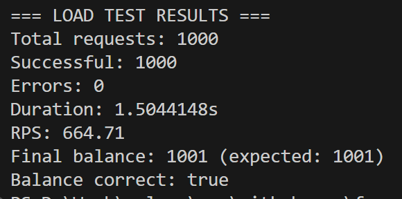

# Wallet Service

Высокопроизводительное REST API для операций с кошельками на Go, разработанное для обработки 1000+ RPS с гарантированной консистентностью данных.



## Возможности

- **Высокая конкурентность**: Оптимизировано для 1000+ RPS на один кошелек
- **Консистентность данных**: Оптимистичные блокировки с механизмом повторов предотвращают race conditions
- **Нет 50x ошибок**: Надежная обработка ошибок и пул соединений
- **Docker-контейнеризация**: Полная система в контейнерах с PostgreSQL
- **Комплексное тестирование**: Unit, интеграционные и нагрузочные тесты

## API Эндпоинты

### POST `/api/v1/wallet`
Обработка операций с кошельком (DEPOSIT/WITHDRAW).

**Запрос:**
```json
{
  "walletId": "123e4567-e89b-12d3-a456-426614174000",
  "operationType": "DEPOSIT",
  "amount": 1000
}
```

**Ответ:**
```json
{
  "status": "success"
}
```

### GET `/api/v1/wallets/{walletId}`
Получение баланса кошелька по его ID.

**Ответ**

```json
{
  "walletId": "123e4567-e89b-12d3-a456-426614174000",
  "balance": 1500
}
```

## Структура
```
wallet-service/
├── cmd/
│   └── server/
│       └── main.go             # Точка входа приложения
├── internal/
│   ├── config/
│   │   └── config.go           # Управление конфигурацией
│   ├── database/
│   │   └── database.go         # Подключение к БД и миграции
│   ├── handler/
│   │   ├── wallet.go           # HTTP обработчики
│   │   ├── router.go           # Определение роутов
│   │   └── wallet_test.go      # Интеграционные тесты
│   ├── model/
│   │   ├── wallet.go           # Доменные модели
│   │   └── dto.go              # DTO объекты
│   ├── repository/
│   │   └── wallet.go           # Операции с БД
│   └── service/
│       ├── wallet.go           # Бизнес-логика
│       ├── interface.go        # Интерфейсы сервисов
│       └── wallet_test.go      # Unit тесты
├── migrations/                 
│   └── 001_create_wallets.sql  # Миграция для создания таблицы кошельков
├── loadtest.go                 # Утилита нагрузочного тестирования
├── docker-compose.yml
├── Dockerfile
├── config.env
└── README.md
```
## Запуск

Для запуска необходимы:

    - Docker
    - Docker Compose

### 1. Клонирование и настройки
``` 
git clone github.com/forygg/wallet-service
cd wallet-service
```
### 2. Запуск системы
```
docker-compose up --build    
```
### 3. Проверка
```
curl http://localhost:8080/health
# Должен вернуть: OK
```

## Тесты и результаты

### Unit тесты
```
go test ./internal/
service/...
                                                      # Результат:                      
ok      wallet-service/internal/service
```

### Integration тесты
```
go test ./internal/handler/...

# Результат:
ok      wallet-service/internal/handler
```

### Stress тест (1000 RPC)
```
go run loadtest.go

# Результат
=== LOAD TEST RESULTS ===
Total requests: 1000
Successful: 1000
Errors: 0
Duration: 1.5044148s
RPS: 664.71
Final balance: 1001 (expected: 1001)
```